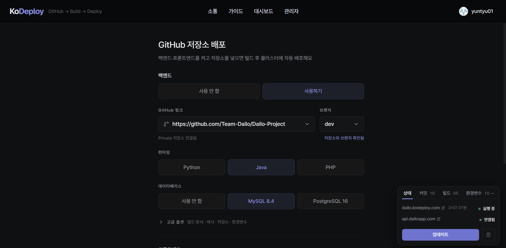
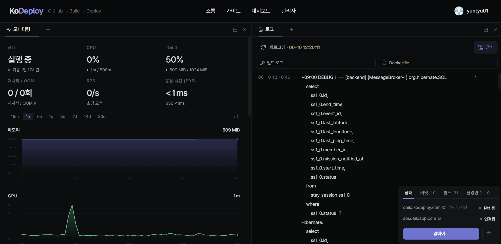

# KoDeploy

GitHub 저장소 URL을 받아 컨테이너로 빌드하고 `{앱이름}.kodeploy.com` 서브도메인으로 서비스하는 미니 PaaS. self-service 배포, 런타임별 golden path, K8s 추상화, 멀티테넌시를 갖춘 작은 IDP(Internal Developer Platform)다.

Heroku 무료 티어가 사라진 뒤 학생이 캡스톤·해커톤 결과물을 올릴 곳이 마땅치 않다. Railway나 Render는 슬립이 잦거나 금방 과금으로 넘어간다. 학교·동아리 규모의 신뢰 기반 사용자라면 클러스터 하나를 공유해서 이 문제를 풀 수 있겠다 싶어 만들었다. 지금은 지인 초대 기반으로 [app.kodeploy.com](https://app.kodeploy.com)에서 운영 중이다.

OCI Always Free ARM 한도(4 OCPU / 24GB)에 유료 노드 1대(2 OCPU / 4GB)를 더해 월 2만원 이하로 운영한다. 노드 4대 위에 kubeadm으로 직접 구성한 Kubernetes 클러스터에서 돌아간다. 사용자는 kubectl을 쓰지 않는다. 클러스터 조작은 전부 백엔드 API가 대신 수행하고, 사용자별 격리는 1유저=1네임스페이스와 Calico 정책으로 처리한다. 단독 운영하는 프로젝트다. KoDeploy 백엔드 자체도 이 클러스터 위에서 돌아가고, 프론트는 Cloudflare 정적 호스팅으로 서빙된다.




## 배포 흐름

1. 웹 폼에서 repo URL과 런타임(Python/Java/PHP/정적)을 골라 제출한다.
2. 백엔드가 `kodeploy-build` 네임스페이스에 rootless BuildKit Job을 만든다. repo에 Dockerfile이 있으면 그대로 쓰고, 없으면 nixpacks가 Dockerfile을 생성한다. 둘 중 무엇을 쓸지는 GitHub tree API로 자동 감지한다.
3. 빌드된 이미지를 GHCR에 push하고 유저 전용 네임스페이스에 배포한다. 빌드 로그는 진행 중에 1초 단위로 웹에 그대로 보인다.
4. `*.kodeploy.com` 와일드카드 DNS가 이미 로드밸런서를 가리키고 있어 별도 DNS 작업 없이 바로 접속된다. HTTPS는 Cloudflare 프록시와 Envoy Gateway의 TLS 종료로 적용된다.

private repo는 GitHub App 설치로 지원한다. 빌드 시점에 1시간짜리 installation token을 발급해 clone하고, 토큰은 해당 유저의 repo에만 스코프된다.

## 앱 구성

한 유저는 앱 하나를 가진다. 앱은 두 슬롯으로 구성된다.

- 서버 슬롯 - Python/Java/PHP 런타임. `{앱이름}-api.kodeploy.com`
- 정적 슬롯 - 빌드 산출물을 nginx로 서빙. 켜면 `{앱이름}.kodeploy.com`이 정적으로 넘어가고 서버 주소는 그대로 유지된다.

서버 슬롯에는 MySQL/PostgreSQL/Redis/영속 스토리지를 토글로 붙일 수 있다. 토글을 꺼도 PVC와 데이터는 보존된다. 다시 켜면 그대로 복원된다. 오브젝트 스토리지는 Cloudflare R2에 앱당 버킷을 만들고 bucket-scoped 토큰을 발급하는 방식이다.

그 외:

- 커스텀 도메인 연결 (Cloudflare for SaaS custom hostname)
- 웹 터미널 - 브라우저에서 앱 Pod에 exec
- DB 콘솔과 덤프 복원, 메트릭 대시보드(VictoriaMetrics), R2 스토리지 브라우저

## 구조

```
terraform/   OCI 인프라(VCN·노드·NLB) + Cloudflare(DNS·터널·보안)
ansible/     클러스터 부트스트랩 - containerd부터 Envoy Gateway까지 순서대로
deploy/k8s/  플랫폼 매니페스트 (Core API, Gateway, 모니터링, Calico)
core/        백엔드 - FastAPI. K8s API를 조작하는 유일한 컴포넌트
web/         프론트 - React + Vite. Cloudflare에 정적 배포
docs/        기술 문서
```

## 로컬 실행

호스티드 서비스라 로컬 실행은 개발용이다. 백엔드와 DB만 docker-compose로 뜬다.

```sh
docker compose up        # MySQL + API (localhost:8000)
cd web && npm run dev    # 프론트 (localhost:5173)
```

GitHub 로그인이 필요하면 `GITHUB_CLIENT_ID`/`GITHUB_CLIENT_SECRET` 환경변수를 넣어야 한다. 빌드·배포 기능은 K8s 클러스터와 GHCR 자격증명이 있어야 동작한다.

## 다음에 할 것

- 운영자용 모니터링 그라파나 적용
- 장애·리소스 알림 
- 빌드 실패 로그를 LLM으로 분석해 한국어로 원인을 알려주는 기능
- LLM 호출의 토큰·비용·레이턴시를 기존 메트릭 체계로 추적
- 사용자 앱 롤백
- 오토스케일링
